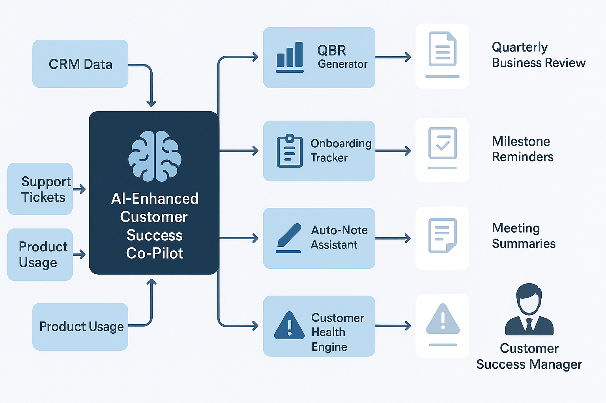

# 🤖 AI-Enhanced Customer Success Co-Pilot

**Smart Assistant for SaaS Customer Success Teams**  
Built by Troy Essick — Customer Success Manager | Cloud ERP Strategist | AI Explorer

---

## 🧭 Project Overview

The **AI-CSM Co-Pilot** is a GPT-powered assistant designed to support Customer Success Managers in SaaS and ERP environments. It automates key customer success workflows including:

- **Quarterly Business Review (QBR) preparation**
- **Onboarding milestone tracking**
- **CRM and account note updates**
- **Proactive health scoring and sentiment alerts**

This project brings 17+ years of SaaS and ERP delivery experience into a new era of **AI-assisted customer engagement**.

---

## 💡 Key Features (In Progress)

| Module | Description |
|--------|-------------|
| 📊 QBR Generator | Pulls recent CRM notes, ticket history, KPIs, and adoption data to auto-draft slide decks |
| 🚦 Customer Health Engine | Analyzes product usage, sentiment, and open issues to generate risk signals |
| ✅ Onboarding Tracker | Sends reminders, milestones, and automates handoff docs |
| ✍️ Auto-Note Assistant | Summarizes meetings, updates CRM fields, and logs action items |
| 📅 Smart Scheduler | Recommends next check-ins based on lifecycle stage and engagement trends |

---

## 🧠 Prompt Templates & Tools

- 🔹 [QBR Slide Generator Prompt](./prompts/qbr_slide_generator.md):  
  Auto-drafts quarterly business review content from CRM and account insights.

- 🛠️ [CRM Auto-Note Generator (Python Script)](./scripts/crm_auto_note_generator.py):  
  Summarizes customer meeting transcripts into CRM-ready summaries.

- 🧭 [AI Co-Pilot Flowchart](./docs/ai_csm_flowchart.png):  
  Visual overview of how the AI system powers QBRs, onboarding, CRM summaries, and health scoring.

### 🔍 Flowchart Preview

---

## 🛠️ Tech Stack

- **LLMs**: OpenAI GPT-4 (via API or prompt engineering)
- **Backend (Planned)**: Python, LangChain, Flask
- **Integrations (Mock or Real)**: Salesforce, Gainsight, Jira, ServiceNow
- **Automation**: Python scripts, Zapier, Make
- **Data Sources**: CSVs, mock APIs, CRM exports

---

## 📁 Repo Structure (Planned)

---

## 🚀 Roadmap

- [x] Define use cases (QBR, onboarding, health scoring)
- [x] Write initial prompt templates
- [ ] Build mock data sets and scripts
- [ ] Publish MVP demo or video walkthrough
- [ ] Expand to full integrations (CRM or ticketing system)

---

## 📄 Background

This project reflects my long-standing experience with:
- Managing customer lifecycles across Infor, Oracle, and ServiceNow platforms
- Delivering successful ERP and cloud SaaS programs for healthcare, logistics, and education
- My current focus on making AI **accessible and tactical** for Customer Success teams

---

## 🙌 Contributing / Feedback

This is a personal learning and demo project. If you're working on similar tools or interested in AI-powered CSM enablement, feel free to reach out or open a discussion.

---

## 📫 Contact

- [LinkedIn](https://www.linkedin.com/in/troy-essick/)
- [GitHub Portfolio](https://github.com/TroyEssick/troy-essick-portfolio)
- 📧 troy325@hotmail.com

---

> “AI won't replace Customer Success — but CSMs who use AI will outperform those who don't.”

